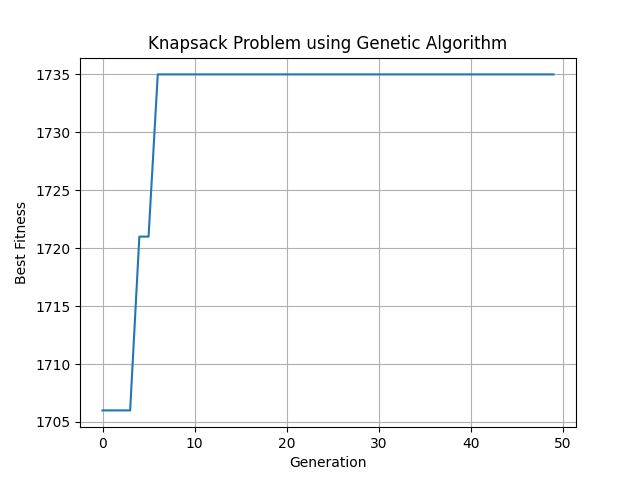

# Genetic Algorithm for the 0/1 Knapsack Problem

This project implements a Genetic Algorithm (GA) to solve the classic 0/1 Knapsack Problem using Python.

## Problem Statement

Given a list of items, each with a weight and a value, determine the most valuable combination of items to include in a knapsack without exceeding its weight limit.

## Features

- Binary genome representation of item selections
- Tournament selection
- Single-point crossover
- Bit-flip mutation
- Elitism to retain best individuals
- Fitness graph visualization using `matplotlib`

## Step by step functions

- Initialization: Create a random population of binary genomes.
- Fitness Evaluation: Compute the total value of items without exceeding the weight limit.
- Selection: Use tournament selection to choose parents.
- Crossover: Perform single-point crossover between parents to generate children.
- Mutation: Flip bits in the genome with a specified mutation probability.
- Survivor Selection: Keep the top 2 solutions and fill the rest of the population with offspring.
- Iteration: Repeat the process over multiple generations.
- Visualization: Plot the best fitness value in each generation.

## Best solution

[0, 1, 0, 1, 0, 0, 1]
Fitness value = 1735
**Dataset used:** [P06](https://people.sc.fsu.edu/~jburkardt/datasets/knapsack_01/knapsack_01.html)

## Sample output



## Requirements

- Python 3.8 or later
- `matplotlib` library

Install matplotlib with:

```bash
pip install matplotlib


